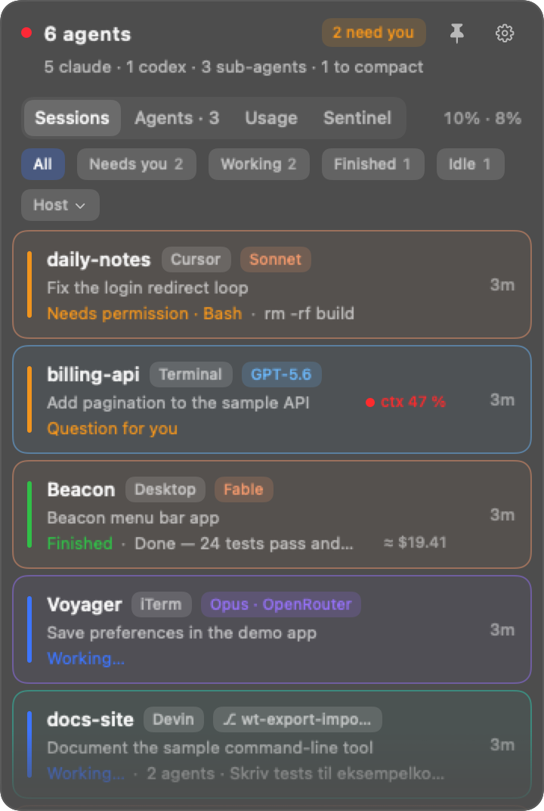
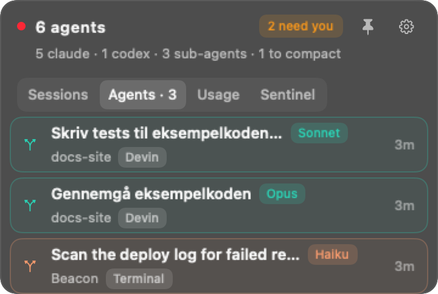
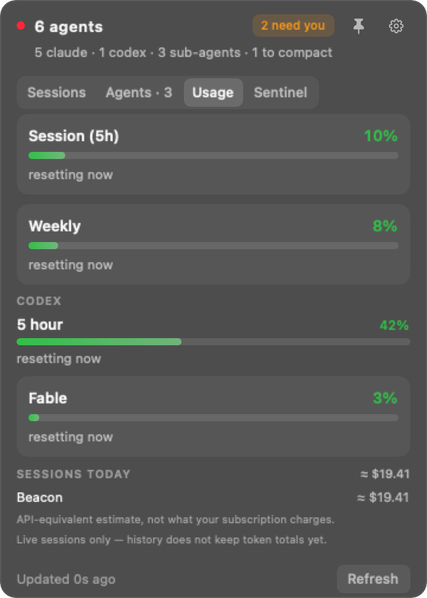
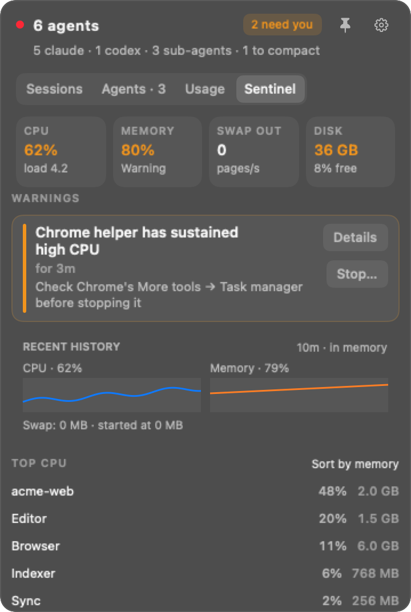
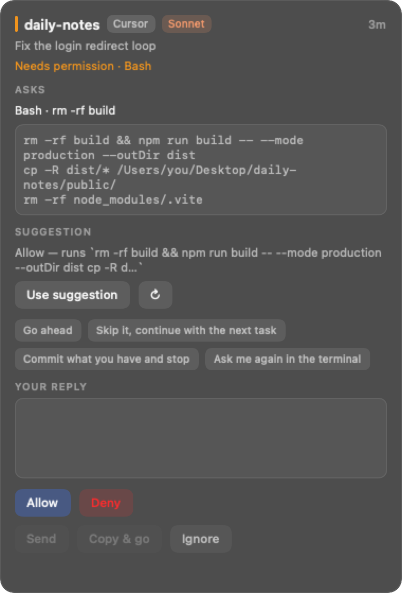

# Beacon

**Keep your AI coding agents and your Mac in view.**

Beacon is a native macOS menu-bar app for people running several Claude Code, Codex or other
coding-agent sessions. See what is working, what has finished and what needs your attention;
jump back to the right session, answer supported requests, and spot resource-heavy processes
without losing track of your work.

Formerly Lookout. A personal, community-developed project maintained by
[Luke Norgaard](https://github.com/lukenorgaard), released under the [MIT license](LICENSE).

<p align="center">
  
</p>

## What it can do

- **Track sessions and sub-agents.** Live state, project, model, elapsed time and context usage;
  filter by state or host, sort by activity or project, and pin important sessions.
- **Bring you back to the work.** Jump to a supported editor, terminal or desktop session.
  Optional notifications and configurable global shortcuts help you respond quickly.
- **Answer supported requests.** Attention cards show permission requests and questions. Allow,
  deny, send a reply or use Copy & go. Presets fill the reply field; you choose when to send.
  Support depends on the agent and version; some integrations use undocumented interfaces.
- **See usage.** Claude account limits from Anthropic, Codex limits from local session files,
  context indicators and per-session cost estimates. Estimates use editable prices, not your bill.
- **Watch your Mac with Sentinel.** CPU, memory pressure, swap and disk gauges, recent resource
  charts, apps ranked by CPU or memory, and explanations with practical next steps. Sustained
  Chrome helper overload can offer a confirmed Stop action. [How Sentinel works](docs/SENTINEL.md).
- **Choose your reply suggestions.** Built-in heuristics, your configured Ollama server or your
  own Claude CLI. Review suggestions before sending; model providers may receive session context.
- **Make it fit.** Menu-bar or pinned-panel mode, adjustable size and appearance, optional session
  history, editable reply presets and keyboard shortcuts.

## Screenshots

All screenshots are rendered from fictional example data using the actual app views.

| Sessions | Agents |
|---|---|
|  |  |

| Usage | Sentinel |
|---|---|
|  |  |

<p align="center">
  
</p>

## Install

Requires **macOS 14 or later**, Xcode command-line build tools with Swift 5.9 or later, and Python 3.
The supported starting point is a local build from source:

```sh
git clone https://github.com/lukenorgaard/beacon.git
cd beacon
CODE_SIGN_IDENTITY=- bash scripts/build.sh
```

This builds a universal Intel/Apple Silicon app at `build/Beacon.app`, with an ad-hoc signature.
It does not install it or change your agent hooks. Copy the app to Applications, open it and use
its setup screen to install the integrations you want. Close any older Lookout instance first.

Read the [installation and upgrade guide](docs/INSTALL.md) for permissions, hook setup,
companion installation, local packaging and removal. The
[Releases page](https://github.com/lukenorgaard/beacon/releases) lists published binaries when
available; a successful source build is not an Apple notarization or a security certification.

## Privacy and control

Beacon has no maintainer-operated backend, telemetry or analytics. Public source code does not
grant anyone access to your computer or accounts. The app does handle sensitive local data when
running, so these boundaries matter:

| Feature | Data and access |
|---|---|
| Session monitoring | Reads local session metadata, transcript excerpts and process information; stores state under `~/.lookout` |
| Claude usage | Uses **your** Claude Code OAuth credential from Keychain for Anthropic's HTTPS usage endpoint |
| Claude/Ollama suggestions | Sends selected context through your CLI or configured server; may consume your plan or credits |
| Editor companion | Authenticated server bound to `127.0.0.1`; authorized terminal input can execute commands |
| Answers and process actions | Your explicit action can affect a running session; stopping a process can lose unsaved work |
| Sentinel charts | Resource totals retained in memory for up to fifteen minutes; no browsing URLs or tab contents |

Do not upload your `~/.lookout` directory, real transcripts, tokens or unreviewed screenshots to
issues. Text excerpts can contain secrets even when a field is named “summary”. Read
[SECURITY.md](SECURITY.md) for the full data flow, limitations and private vulnerability reporting.

## Development and contributions

```sh
swift test
bash tests/test_reporter.sh
node --test companion/test
python3 scripts/check-code-size.py
python3 scripts/package-source.py
```

Code and configuration files stay at or below **500 physical lines**. Tests use isolated fixtures;
regenerate screenshots deliberately with `LOOKOUT_REGENERATE_SCREENSHOTS=1 swift test --filter Readme`.
The source ZIP includes source, tests and documentation, with a checksum manifest.

Fork this repository, branch from `main` and submit a pull request from your own account.
Luke reviews proposed changes before merging; attribution stays with the contributor.
See [CONTRIBUTING.md](CONTRIBUTING.md), the [source map](docs/SOURCE-MAP.md) and
[reporter reference](docs/REPORTER.md). Your own improvements should be submitted separately from
this original baseline.

## License and support

[MIT](LICENSE). The software is provided as-is, without warranty, under the license's liability
terms. This is a personal project with no guaranteed support, compatibility or release schedule.
It is not affiliated with Apple, Anthropic, OpenAI, Google or the supported editors. Their names
identify compatibility; their own terms still apply. A license disclaimer does not remove every
legal obligation or establish ownership of third-party contributions.
